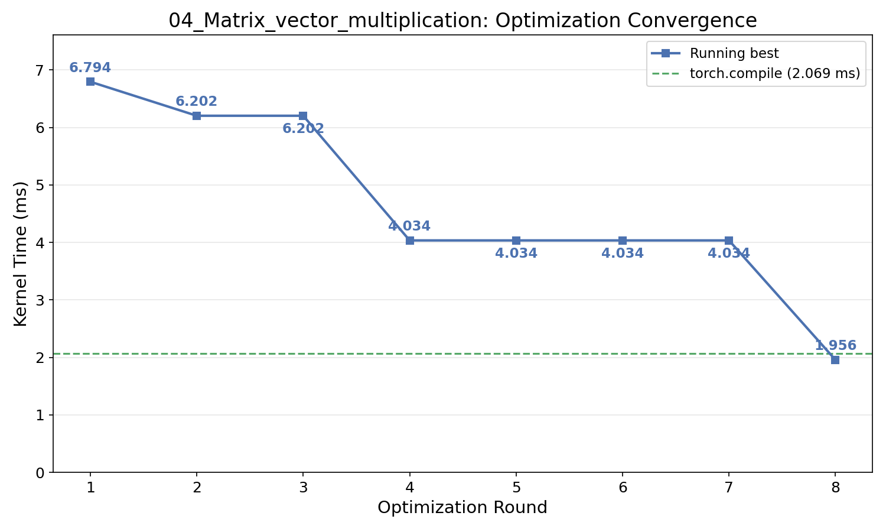
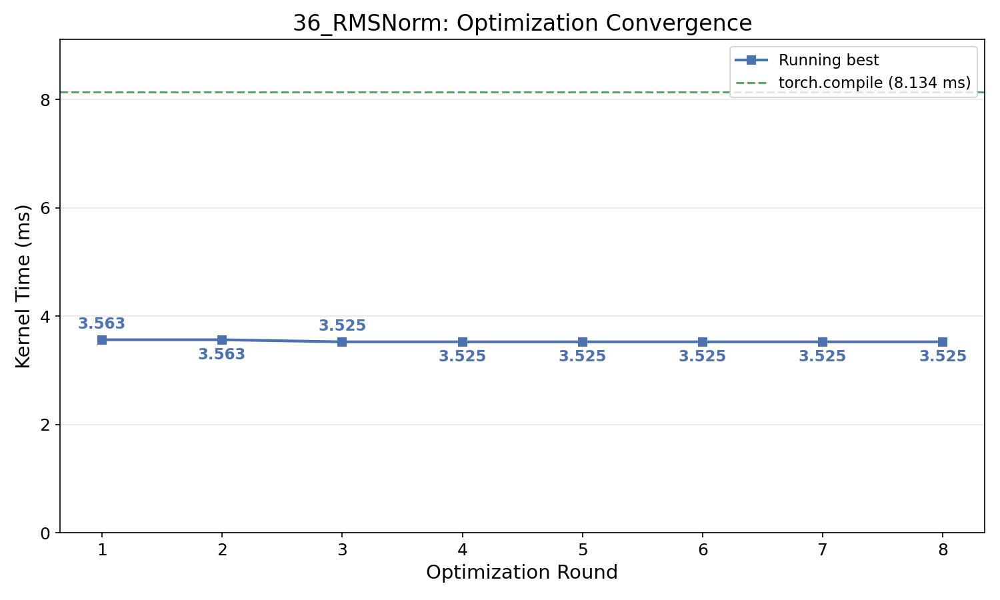
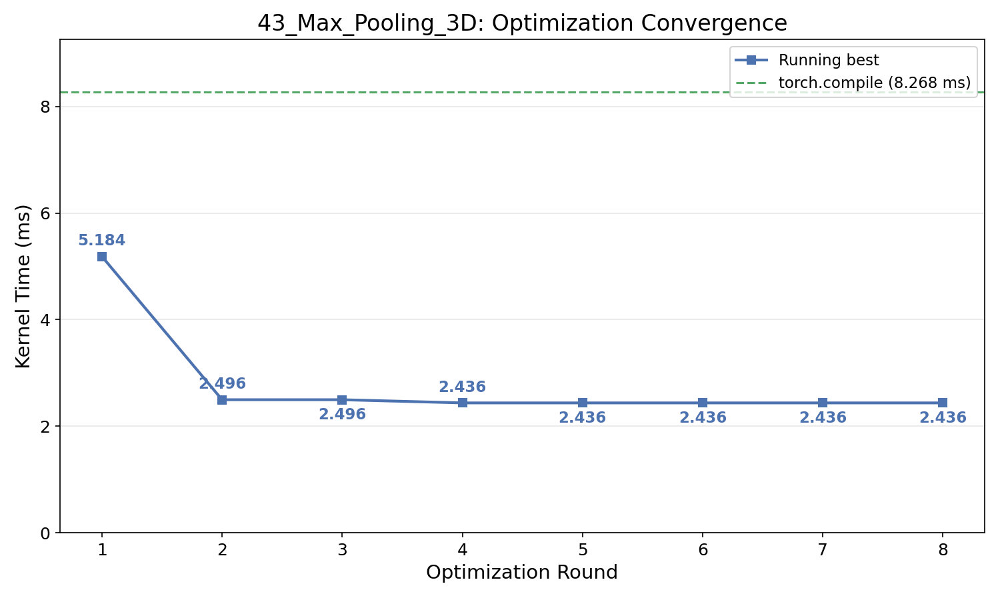
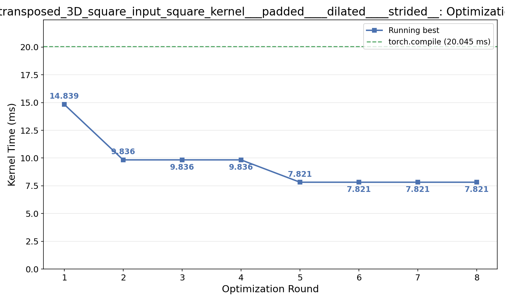
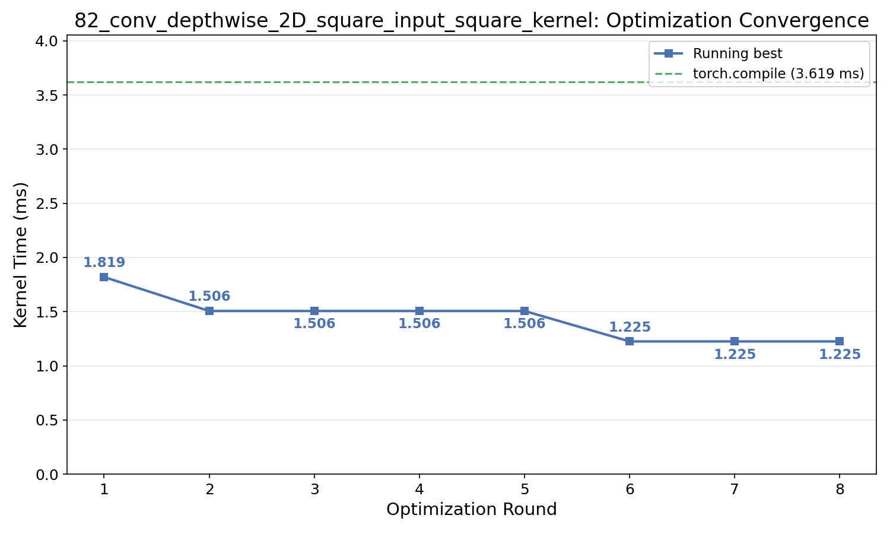

# KernelAgent Optimization Artifacts

Curated artifacts showcasing the KernelAgent beam-search optimization loop on KernelBench Level 1 problems.

| Problem | `torch.compile` (ms) | KernelAgent (ms) | Speedup |
|---|---|---|---|
| `4_Matrix_vector_multiplication` | 2.069 | **1.956** | 1.06x |
| `36_RMSNorm` | 8.135 | **3.525** | 2.31x |
| `43_Max_Pooling_3D` | 8.267 | **2.436** | 3.39x |
| `77_conv_transposed_3D_square_padded_dilated_strided` | 20.052 | **7.821** | 2.56x |
| `82_conv_depthwise_2D_square_input_square_kernel` | 3.619 | **1.225** | 2.95x |


All experiments were run on a single H100 GPU. Each problem runs 8 rounds of beam-search optimization with 4 parallel workers, taking roughly 1 hour end-to-end.

These artifacts are meant as a demonstration. Better performance is achievable by running more rounds, or spawning more parallel workers.

Source repo: https://github.com/meta-pytorch/KernelAgent

Blog post: TBD


## Layout

Each problem folder contains:

| File | Description |
|---|---|
| `problem.py` | Original KernelBench problem (PyTorch `Model` class) |
| `input_kernel.py` | Initial Triton kernel (generated by earlier KernelAgent) fed into the optimization loop |
| `optimized_kernel_beam_search.py` | Final optimized Triton kernel (output) |
| `optimization_trace/` | Per-round artifacts from the beam-search optimization |


### Optimization Trace

Each `optimization_trace/round_N/` folder captures one iteration of the profile → analyze → optimize loop. Each round's artifacts come from one worker out of 4 parallel workers in that round:

| File | Description |
|---|---|
| `input_ncu_metrics.json` | NCU profiling metrics for the input kernel |
| `bottleneck_prompt.txt` | LLM prompt for bottleneck analysis |
| `bottleneck_response.txt` | LLM-identified bottleneck |
| `strategy.json` | Optimization strategy derived from analysis |
| `opt_prompt.txt` | LLM prompt for kernel optimization |
| `opt_reply.txt` | LLM-generated optimized kernel variants |
| `reflexion.txt` | LLM self-reflection of the optimization attempt |
| `optimized_ncu_metrics.json` | NCU profiling metrics after optimization |
| `kernel.py` | Round's best kernel |
| `benchmark_results.json` | Performance comparison (ms) |


## Performance Summary

Running-best kernel time (ms) per round — each value is the minimum across all rounds up to and including that round, showing monotonic optimization progress. Speedups are relative to `torch.compile`.

### 04\_Matrix\_vector\_multiplication

`torch.compile`: **2.069ms**\
`input kernel`: **9.510ms**

| Round | 1 | 2 | 3 | 4 | 5 | 6 | 7 | 8 |
|---|---|---|---|---|---|---|---|---|
| Best (ms) | 6.803 | 6.202 | 6.202 | 4.031 | 4.031 | 4.031 | 4.031 | **1.956** |

Best: round 8 — **1.956ms** (1.06x vs torch.compile)

NCU profiling (input → optimized):

| Metric | Input | Optimized |
|---|---|---|
| DRAM throughput (% peak) | 18.5% | **91.1%** |
| DRAM bandwidth (GB/s) | 452 | **2,229** |
| Occupancy (% peak) | 6.2% | **95.2%** |
| L1 cache hit rate | 0.0% | **45.4%** |

The initial kernel severely underutilized memory bandwidth and GPU occupancy. The optimized kernel saturates DRAM throughput at 91% of H100 peak.



### 36\_RMSNorm

`torch.compile`: **8.135ms**\
`input kernel`: **5.461ms**

| Round | 1 | 2 | 3 | 4 | 5 | 6 | 7 | 8 |
|---|---|---|---|---|---|---|---|---|
| Best (ms) |3.563  | 3.563  | **3.525** | 3.525 | 3.525 | 3.525 | 3.525 | 3.525 |

Best: round 3 — **3.525ms** (2.31x vs torch.compile)

NCU profiling (input → optimized):

| Metric | Input | Optimized |
|---|---|---|
| DRAM throughput (% peak) | 82.8% | **89.5%** |
| DRAM bandwidth (GB/s) | 2,025 | **2,189** |
| Compute throughput (% peak) | 20.4% | **8.6%** |

The input kernel was already memory-bandwidth bound at 83% peak. The optimized kernel pushes DRAM utilization to 90% while reducing unnecessary compute, indicating a more efficient memory access pattern.



### 43\_Max\_Pooling\_3D

`torch.compile`: **8.267ms**\
`input kernel`: **6.346ms**

| Round | 1 | 2 | 3 | 4 | 5 | 6 | 7 | 8 |
|---|---|---|---|---|---|---|---|---|
| Best (ms) | 5.216 | 2.672 | 2.672 | **2.436** | 2.436 | 2.436 | 2.436 | 2.436 |

Best: round 4 — **2.436ms** (3.39x vs torch.compile)

NCU profiling (input → optimized):

| Metric | Input | Optimized |
|---|---|---|
| DRAM throughput (% peak) | 30.6% | **66.0%** |
| DRAM bandwidth (GB/s) | 750 | **1,615** |
| Compute-memory throughput (% peak) | 41.9% | **99.5%** |
| L1 cache hit rate | 83.7% | **84.1%** |

The input kernel was compute-bound with low memory throughput. The optimized kernel doubles DRAM bandwidth utilization and achieves near-peak compute-memory throughput.



### 77\_conv\_transposed\_3D\_square\_padded\_dilated\_strided

`torch.compile`: **20.052ms**\
`input kernel`: **28.700ms**

| Round | 1 | 2 | 3 | 4 | 5 | 6 | 7 | 8 |
|---|---|---|---|---|---|---|---|---|
| Best (ms) | 14.839 | 9.836 | 9.836 | 9.836 | **7.821** | 7.821 | 7.821 | 7.821 |

Best: round 5 — **7.821ms** (2.56x vs torch.compile)

NCU profiling (input → optimized):

| Metric | Input | Optimized |
|---|---|---|
| Compute-memory throughput (% peak) | 97.8% | 92.8% |
| Tensor core utilization (% peak) | 1.9% | **4.7%** |
| DRAM bandwidth (GB/s) | 10 | **37** |
| L1 cache hit rate | 99.1% | **98.4%** |

This is a compute-bound 3D transposed convolution. Both kernels operate near peak compute-memory throughput. The optimized kernel improves tensor core utilization and restructures the computation to reduce total work.



### 82\_conv\_depthwise\_2D\_square\_input\_square\_kernel

`torch.compile`: **3.619ms**\
`input kernel`: **2.603ms**

| Round | 1 | 2 | 3 | 4 | 5 | 6 | 7 | 8 |
|---|---|---|---|---|---|---|---|---|
| Best (ms) | 1.818 | 1.506 | 1.506 | 1.506 | 1.506 | **1.225** | 1.225 | 1.225 |

Best: round 6 — **1.225ms** (2.95x vs torch.compile)

NCU profiling (input → optimized):

| Metric | Input | Optimized |
|---|---|---|
| DRAM throughput (% peak) | 16.6% | **70.4%** |
| DRAM bandwidth (GB/s) | 406 | **1,723** |
| Compute-memory throughput (% peak) | 37.4% | **92.2%** |
| Occupancy (% peak) | 91.6% | **98.0%** |
| L1 cache hit rate | 77.0% | **88.6%** |

The input kernel had high occupancy but poor memory throughput. The optimized kernel achieves 4x higher DRAM bandwidth through improved memory access patterns and better L1 cache utilization.




## Reproducing Results

Setup: PyTorch 2.9.1+ with CUDA 12.8 and Triton 3.5.1. \
Kernels were tuned on H100, results on other GPUs will differ.

```bash
# Benchmark all problems
python benchmark.py

# Benchmark a single problem
python benchmark.py 43_Max_Pooling_3D

# Save results to JSON
python benchmark.py --json results.json
```

The script benchmarks four variants per problem: PyTorch eager, `torch.compile`, the input kernel (`input_kernel.py`), and the optimized kernel (`optimized_kernel_beam_search.py`).

Example output:
```
Benchmarking 5 problems on NVIDIA H100

[1/5] 04_Matrix_vector_multiplication
eager=2.068  compile=2.069  input=9.511  opt=1.956  1.06x
[2/5] 36_RMSNorm
eager=12.879  compile=8.135  input=5.457  opt=3.524  2.31x
...

================================================================================
  04_Matrix_vector_multiplication                                 1.956   1.06x
  36_RMSNorm                                                      3.524   2.31x
  43_Max_Pooling_3D                                               2.436   3.39x
  77_conv_transposed_3D_...                                       7.821   2.56x
  82_conv_depthwise_2D_square_input_square_kernel                 1.225   2.95x
```


## Notes

- Kernels are pure Triton implementations (no PyTorch compute helpers in the kernel).
- Verification uses execution-based checks with tolerances (default `rtol=1e-3, atol=1e-3`; relaxed to `1e-2` for fp16/bf16).
- Logs and paths have been scrubbed of infrastructure-specific details.
